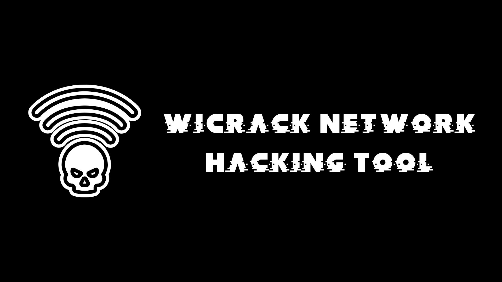
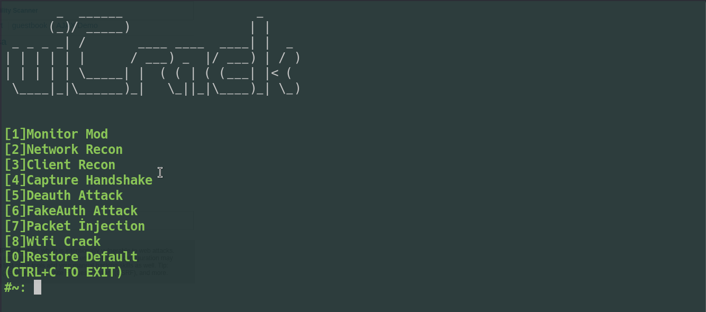

# wiCrack

WiFi pentest is a penetration testing tool that can be used in the field of security testing. 
This tool enables you to automate various wireless penetration testing procedures using the aircrack-ng family within itself. 
 
It allows for automated processes in the field of wireless penetration testing, such as monitor mode, deauthentication, fake authentication, packet injection, and other attack techniques. 
 
The tool operates with its own input system. 
The tool incorporates background data into its parameters via user input, eliminating the need for the user to know or memorize any parameters. 
It is an automated penetration testing tool developed for wireless network penetration testing. 

## Includes
- [ ] Aircrack-ng: Used for cracking WEP and WPA/WPA2-PSK keys.  
- [ ] Airmon-ng: Used for enabling and disabling monitor mode on wireless interfaces.  
- [ ] Aireplay-ng: Used for injecting packets into a wireless network to generate traffic.  
- [ ] Airodump-ng: Used for capturing packets from wireless networks. 
> [!NOTE]
> If you observe any errors within the tool, please contact me at muratmidik@gcybersec.com.tr
## Usage
> git clone https://github.com/favian-jpt/wiCrack.git 
> sudo chmod +x wiCrack.sh 
> ./wiCrack.sh 
